# Raspberry Pi Imager – Betriebssystem auf einen Raspberry Pi Zero 2 W flashen

Diese Anleitung erklärt Dir Schritt für Schritt, wie Du mit dem **Raspberry Pi Imager** ein Betriebssystem (OS) auf eine **microSD-Karte** schreibst, damit Dein **Raspberry Pi Zero 2 W** damit starten kann.

***

## ✅ Was du brauchst

- Raspberry Pi **Zero 2 W**
- **microSD-Karte** (empfohlen: 32 GB)
- **Kartenleser** (USB microSD-Reader) oder SD-Slot am PC/Laptop
- PC/Laptop mit installiertem **Raspberry Pi Imager**
- WLAN-Zugangsdaten (SSID und Passwort)

> ⚠️ **Wichtig:** Beim Schreiben (Flashen) werden **alle Daten auf der ausgewählten microSD-Karte gelöscht**.

***

## Flashen des OS (Betriebssystem auf die SD-Karte schreiben)

### 0. microSD-Karte einstecken
Stecke die microSD-Karte in den Kartenleser und verbinde ihn mit deinem PC.  
Wenn Windows nach einem Datenträger fragt: **einfach schließen / abbrechen**.

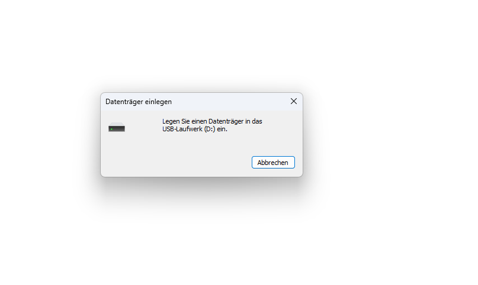

> 💡 Tipp: Falls mehrere Laufwerke angeschlossen sind (USB-Stick, externe Festplatte), entferne sie kurz, damit Du später **nicht aus Versehen** das falsche Laufwerk auswählst.

***

### 1. Raspberry-Pi-Modell auswählen
Öffne den **Raspberry Pi Imager**. Klicke auf **„Modell“** und wähle Dein Gerät aus:

- **Raspberry Pi Zero 2 W**

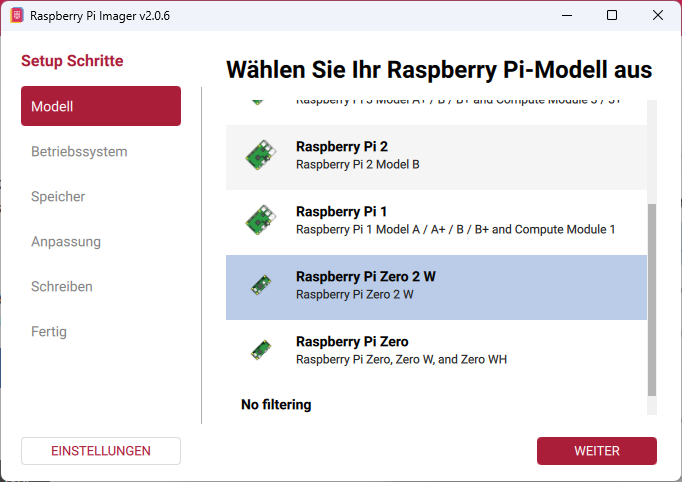

> 💡 Der Imager zeigt *je nach Modell passende Empfehlungen* an.

***

### 2. Betriebssystem (OS) auswählen
Klicke im Raspberry Pi Imager auf **„Betriebssystem“**. Dort legst Du fest, welches System später auf dem Raspberry Pi läuft.

#### 2.0 OS-Kategorie auswählen (falls nötig)
Falls Du nicht sofort die passende Auswahl siehst, kannst Du zunächst eine Kategorie öffnen – zum Beispiel **„Raspberry Pi OS (other)“** – um weitere Varianten angezeigt zu bekommen.

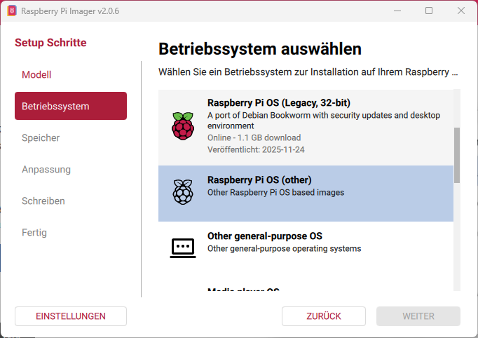

#### 2.1 Betriebssystem auswählen (für unsere Versuche)
Für unsere Versuche reicht **Raspberry Pi OS Lite (64-bit)** völlig aus. Diese Version ist schlank, schnell installiert und läuft **ohne grafische Oberfläche** (Desktop). Das spart Rechenleistung, die wir später für unser Sprachmodell brauchen.

- **Raspberry Pi OS Lite (64-bit)** → ohne Desktop

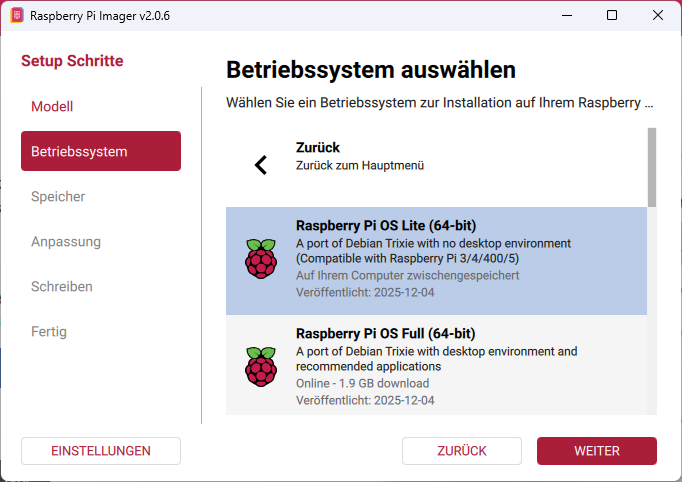

> 💡 **Hinweis:** Später könnt ihr natürlich auch ein anderes Betriebssystem ausprobieren, wenn ihr mehr Funktionen oder eine grafische Oberfläche nutzen möchtet.

***

### 3. Speicher (microSD-Karte) auswählen
Klicke auf **„Speicher“** und wähle die **richtige microSD-Karte** aus.

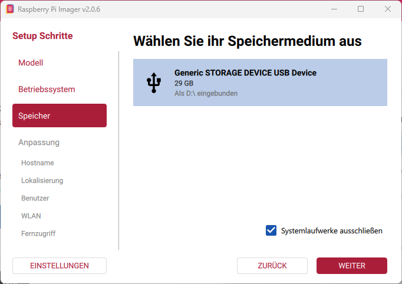

> ⚠️ **Achtung:** Wähle wirklich nur die microSD-Karte aus – sonst könnten Daten auf einem anderen Laufwerk gelöscht werden.  
> 💡 Tipp: Oft erkennt man die SD-Karte an der **Größe** (z. B. 32 GB).

***

## ⚙️ Anpassungen / Einstellungen setzen

Im Imager kannst Du vor dem Schreiben wichtige Einstellungen speichern (z. B. WLAN/SSH).  
Das ist notwendig, wenn dein Raspberry Pi später **ohne Monitor/Tastatur** genutzt wird („headless“).

> ✅ Empfehlung für den Workshop: **Hostname + Benutzer + WLAN + SSH** setzen.

***

### 4. Hostname setzen
Der Hostname ist der Name deines Raspberry Pi im Netzwerk (z.B. `rpi02W-<NAME>`).

> Für den Namen nutzt bitte jeweils die ersten beiden Buchstaben Eures Vor- und Nachnamens.
Beispiel: Für **Fa**bian **Pi**ngel --> *fapi*

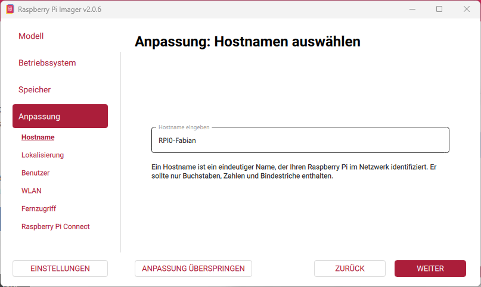

> ⚠️ Achtung: Der Hostname muss eindeutig und einzigartig sein (z. B. rpi02W-fapi, rpi02W-bari, etc.), damit man den Pi im Netzwerk später findet. Ein Hostname darf im selben Netzwerk nicht zweimal vorkommen.

***

### 5. Lokalisierung einstellen
Wähle Land/Zeitzone/Tastaturlayout passend (z. B. **Germany**, **Europe/Berlin**, **de**).

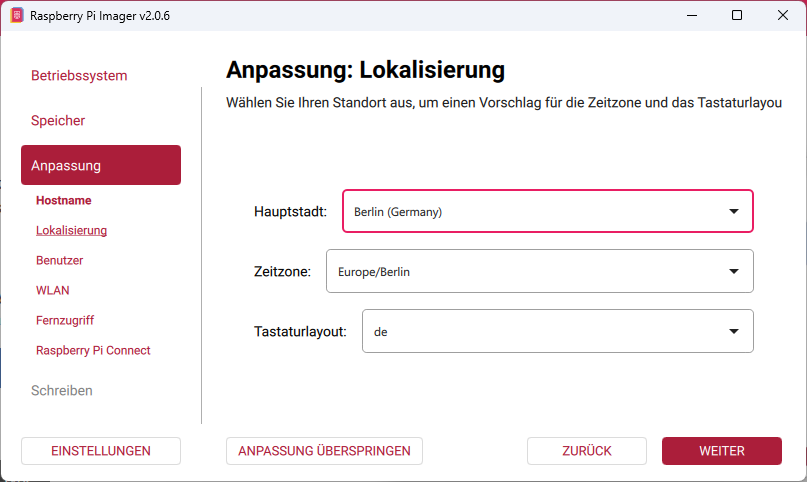

> ✅ Dadurch stimmen Uhrzeit und Tastaturbelegung (z.B. die Tasten Y/Z) im Terminal.

***

### 6. Benutzername und Passwort festlegen
Lege einen Benutzernamen und ein Passwort fest.  
**Merke Dir beides!** Du brauchst es später zum Login.

> 💡 Tipp: Für den Workshop nutzt ihr *jeweils kleingeschrieben* als Benutzer Euren Vornamen und als Passwort Euren Nachnamen.

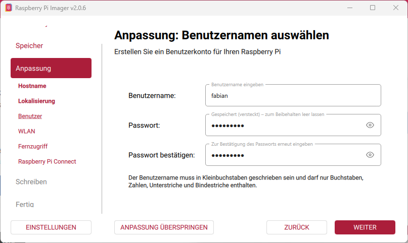

> 🔐 Sicherheit: Später nutzt Du natürlich ein sicheres Passwort, das Du Dir merken kannst – und teilst es mit deiner Lehrkraft nur wenn nötig.
Eine Merkhilfe für sichere Passwörter findet ihr [hier](https://www.kindersache.de/bereiche/wissen/medien/mach-dein-passwort-sicher).

***

### 7. WLAN einrichten
Trage SSID (WLAN-Name) und Passwort ein, damit sich der Raspberry Pi beim ersten Start verbinden kann.

> ❗ Für den Workshop nutzen wir folgendes WLAN:
- SSID
```bash
KI-Workshop
```
- Passwort: 
```bash
Workshop!2026
```

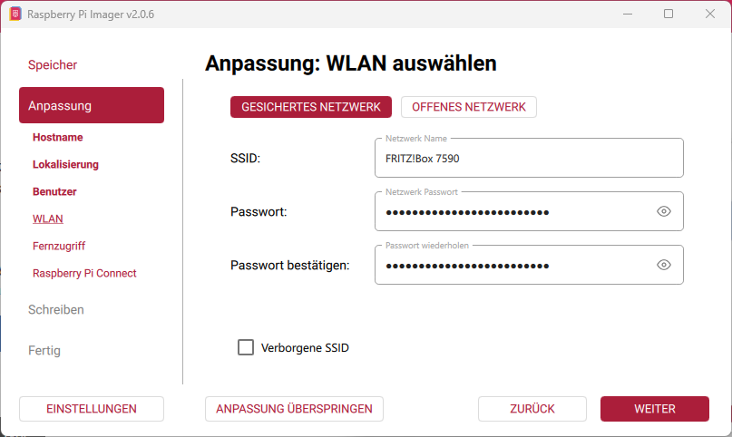

> ⚠️ Achte auf Groß-/Kleinschreibung beim Passwort.  
> 💡 Tipp: Der Pi Zero 2 W nutzt häufig **2.4 GHz WLAN** – falls es Probleme gibt, prüft das zu Hause/im Schulnetz.

***

### 8. SSH aktivieren (für Fernzugriff)
Aktiviere **SSH**, damit Du später per Terminal von deinem PC aus auf den Raspberry Pi zugreifen kannst.

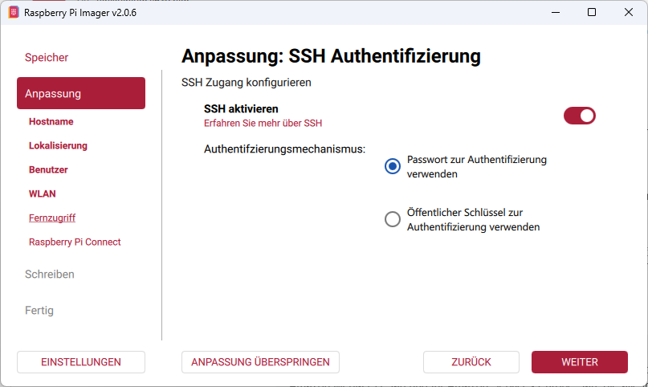

#### Was ist SSH?
**SSH** steht für **Secure Shell**.  
Damit kannst Du dich von deinem PC aus per *Terminal* mit dem Raspberry Pi verbinden – sicher und verschlüsselt. Du steuerst den Raspberry Pi dann über Textbefehle, ohne dass ein Bildschirm oder eine Maus am Pi angeschlossen sein müssen.

#### Warum brauchen wir SSH?
Bei unseren Versuchen ist der Raspberry Pi „headless“ unterwegs – also ohne Monitor, Tastatur und Maus. SSH ist dann wie eine Fernbedienung:
✅ Du kannst dich einloggen, obwohl am Pi kein Bildschirm hängt  
✅ Du kannst Programme starten, Dateien kopieren und Einstellungen ändern  
✅ Du kannst Fehler schnell finden (z.B. Netzwerk prüfen, Updates machen)  
✅ Du kannst den Pi im Netzwerk erreichen (z.B. im Klassenraum-WLAN)

> ✅ Empfehlung: Nutze „Passwort-Authentifizierung“ (einfacher für den Einstieg).  
> (Später kann man auch Schlüssel zur Authentifizierung“ benutzen – das ist aber was für Fortgeschrittene.)

***

### 9. Raspberry Pi Connect (optional)
Dieses Feature ist optional und kann deaktiviert bleiben.

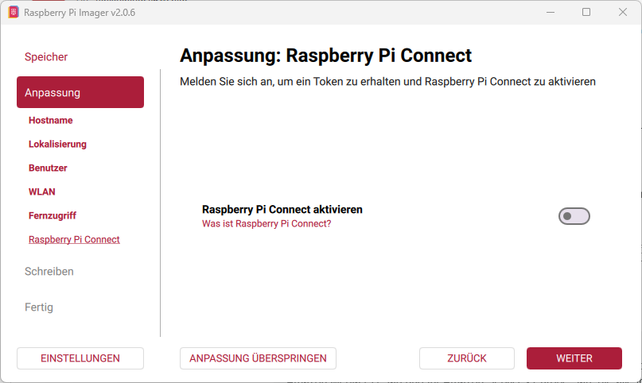

***

## Schreiben (Flashen) starten

### 10. Zusammenfassung prüfen
Kontrolliere, ob Modell, OS und Speicher korrekt sind.

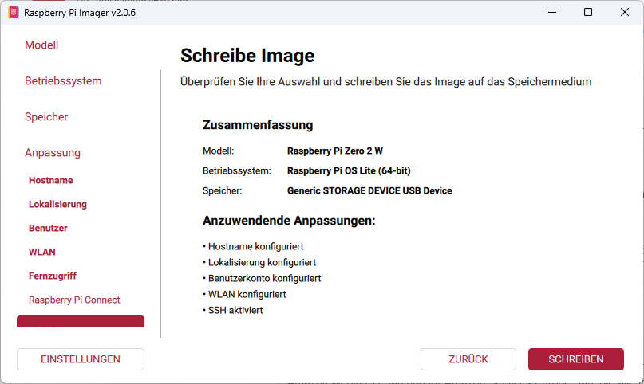

Klicke dann auf **„Schreiben“**.

> ✅ Checkliste vor dem Klick:
> - Modell: **Zero 2 W**
> - OS: **Raspberry Pi OS Lite (64-bit)**
> - Speicher: **deine microSD-Karte** (richtige Größe)

***

### 11. Warnhinweis bestätigen und Schreiben
Der Imager warnt, dass alle Daten gelöscht werden.  
Wenn Du sicher bist: **„Ich verstehe. Lösche und schreibe“**.

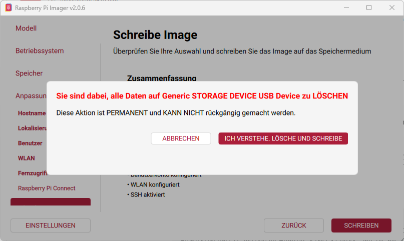

> ⚠️ Bestätige nur, wenn Du wirklich die **richtige SD-Karte** ausgewählt hast.

#### ⚠️ Windows-Meldung „Datenträger einlegen“ (kann ignoriert werden)
Manchmal erscheint während des Schreibvorgangs in Windows ein Fenster wie „Datenträger einlegen“.  
Das passiert, weil die SD‑Karte beim Flashen kurz neu erkannt wird.

✅ **Klicke einfach auf „Abbrechen“** und lass den Raspberry Pi Imager weiterarbeiten.  
❗ **Wichtig:** SD‑Karte nicht abziehen!


***

### 12. Schreibvorgang abwarten
Währenddessen **nichts abziehen**. Der Imager schreibt und prüft anschließend das Image.

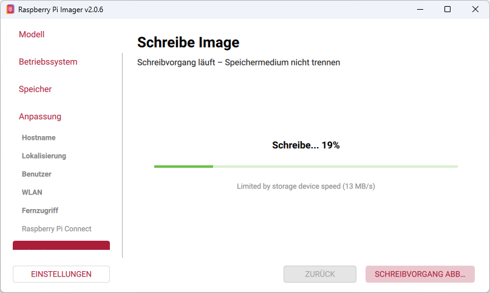

> ⏳ Das kann je nach SD‑Karte ein paar Minuten dauern.  
> (Langsame oder sehr alte SD‑Karten brauchen deutlich länger.)

***

## ➡️ Nächste Schritte

1. Wenn „Fertig“ angezeigt wird: **SD-Karte sicher entfernen** (Auswerfen).
2. microSD in den **Raspberry Pi Zero / Zero 2 W** stecken.
3. Raspberry Pi mit Strom verbinden (USB‑Power).
4. Beim ersten Start wird es ein paar Minuten dauern (Erst‑Setup).
5. Wenn die gründe LED nicht mehr blinkt, sind alle Lese-/Schreibvorgänge auf der SD Karte abgeschlossen.

> ➡️ Jetzt geht’s weiter mit Kapitel 4: [⚙️ **Erste Einrichtung: Start, IP finden, SSH**](04_ssh_setup.md), um den Pi ohne Monitor zu steuern.

***

# 🛠️ Troubleshooting (wenn etwas mal nicht klappt)

## 🚧 Problem 1: SD-Karte wird nicht angezeigt

Kartenleser neu einstecken oder anderen USB‑Port testen.

## 🚧 Problem 2: Schreiben bricht ab
Andere SD‑Karte verwenden (manche sind defekt oder sehr langsam).


## 🚧 Problem 3: Raspberry Pi startet nicht

  - Prüfe, ob wirklich **Zero 2 W** gewählt wurde.
  - Flash-Vorgang wiederholen (Imager erneut ausführen).
  - Netzteil prüfen (5V/2.5A, Micro‑USB).

## 🚧 Problem 3: Kein WLAN
  - SSID/Passwort prüfen (Groß-/Kleinschreibung!)
  - Prüfen, ob **2.4 GHz** verfügbar ist.


